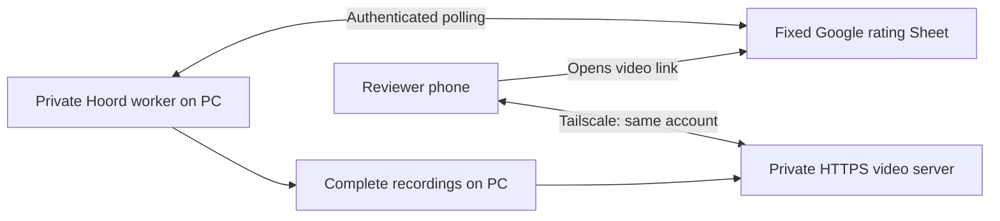

# Private PC video connection and Google Sheets review

This production integration lets a person review full weapon animations from a phone while the Hoord Dev Panel continues generating on a PC. A fixed Google Sheet carries ordered video links and human feedback. The MP4 recordings stay on the PC and stream over a private Tailscale HTTPS connection.

## How the devices communicate



The phone uses Google Sheets for ratings and Tailscale for video access. The host PC must remain awake, online and running the owning Dev Panel. The server does not grant access to the PC's desktop or other files. Publishing this source does not host the videos on GitHub or make the private video address public.

## Included source

| File | Responsibility |
| --- | --- |
| `video_host/` | Embedded Tailscale node, owner-only authorization, complete-recording checks, HTTPS and byte-range playback. |
| `pc_video.py` | Starts the host under a Dev Panel process and constructs validated private video links. |
| `sheets_review.py` | Authenticated polling, identity checks, publication, archival acknowledgments and migration of video hosts. |
| `google_sheets_bridge.gs` | Fixed-Sheet endpoint; protects ratings and notes while updating links and archiving processed rows. |
| `appsscript.json` | Explicit Sheets-only Google OAuth scope. No Drive service. |
| Tests and `test_worker_stub.py` | Synthetic transport/storage fixtures. No model, generation or training implementation. |

These are transport components, not a standalone review application. The private worker provides state storage, timestamps, process ownership, recorded items and measured generation statistics. Its engine, generation/training logic, model files, prompt collections, recordings, account configuration and feedback records are not included.

## Review semantics

Each output has a permanent W-ID, round identity and source digest. Column A contains a full-animation link, B the human rating, C its ID/name, D the measured duration and E notes. Hidden round/digest columns bind each row to its source.

- Blank means unmarked.
- Explicit `null` or `0` dismisses without training.
- Human scores are `-2`, `-1`, `1`, `2`.
- `-3` is reserved for confirmed native compilation failures, supplied with compiler provenance by the private worker. Video/network failures do not imply a code penalty.

The bridge archives before deleting. Changed identities, ratings or notes prevent removal. A preview update preserves human marks. The bridge records feedback; it does not implement training or prove that a model has learned from a score.

## Security boundary

The server listens only on Tailscale HTTPS. The connecting device must belong to the same Tailscale user as the server owner; tagged devices are denied. There is no public Funnel, directory listing, arbitrary file path, upload route or remote-control interface. GET, HEAD and byte ranges support playback and seeking. Source identity, full frame/duration evidence and on-disk preview evidence must match before a clip is served.

The Apps Script authenticates before reading the Sheet. Google redirects are restricted to its result host and never receive the machine secret again. The code targets one fixed spreadsheet; Google's Sheets OAuth scope itself is broader than one document. Machine keys and Tailscale state belong in an access-restricted local state directory, never this repository. HTTPS certificate transparency records contain the generated hostname, but the service remains private.

## Adapting the integration

Personal Sheet and Apps Script IDs were removed. Replace `YOUR_SPREADSHEET_ID` in the bridge, and replace `__TOKEN_SHA256__` with the SHA-256 verifier of a newly generated high-entropy local machine secret. Configure a private worker with that secret and the deployed Google `/exec` URL. Do not commit either value. Use the supplied explicit Sheets-only manifest, preserve the existing sheet's layout and run setup before deployment.

The worker contract supplies `WORKSPACE`, `STATE`, `read`, `save`, `now`, `owner_alive`, `generation_stats` and `generation_timings`. Recordings live at `STATE/previews/<round>/animation.mp4`, with adjacent `preview.json`; `items.json` contains their identity and complete capture evidence. A successful host connection writes local `video-host.json` with the private hostname. Initial polling can use `max_outputs=0`; background polls can use a small bound such as 20 to avoid slow bulk writes.

The Go host currently targets Windows and pins Go 1.27.1/Tailscale dependencies. From `video_host`, run `go test ./...`, then build `hoord-video-host.exe` into the worker's `WORKSPACE/work/tools` directory. The process takes `--state <protected-directory>` and `--owner-pid <Dev-Panel-PID>`. No machine credentials are bundled. Its embedded node is not an operating-system VPN client for other browser applications.

Sign into Tailscale, enable HTTPS certificates for the private hostname, and connect the phone using the same account. Keep the existing free-personal-plan/no-paid-fallback policy where eligible; this code has no billing or upgrade operation.

## Local checks

From this folder:

```text
python -m unittest test_sheets_review
node test_google_sheets_bridge.cjs
```

From `video_host`:

```text
go test ./...
```

The Go tests cover denied access, read-only methods, byte ranges, HEAD, path containment, identity conflicts and incomplete capture evidence. Bridge tests cover authorization, explicit zero, archive-before-delete, changed marks/identities and idempotent migration that preserves notes. Transport tests use only the clearly labeled synthetic worker stub.
